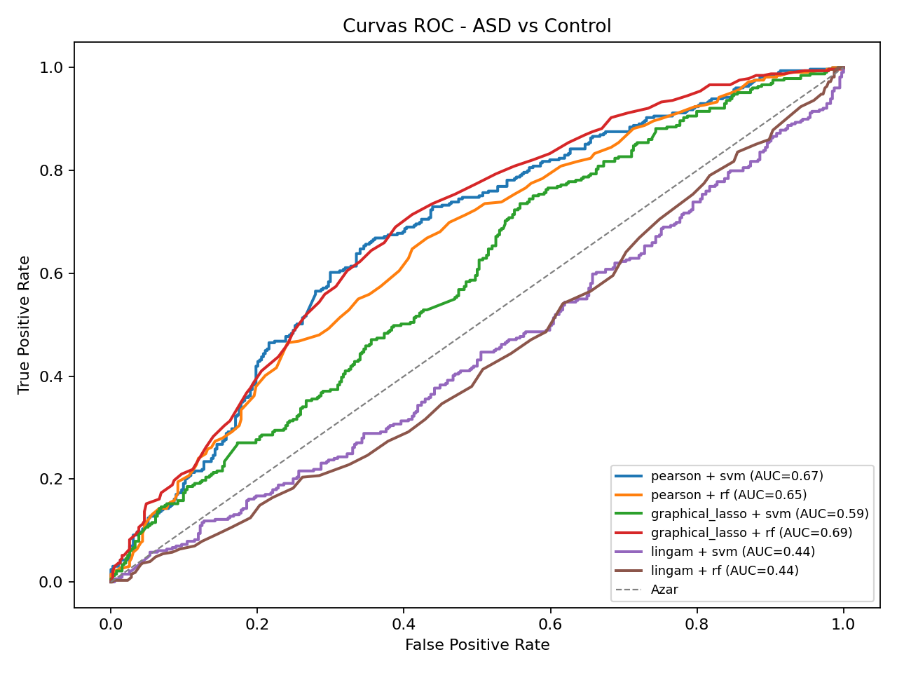

# Machine Learning causal en Resonancia Magnética Funcional

Repositorio de implementación de la tesis de Cristian Raúl Salgado Torres,
desarrollada en la Escuela de Ingeniería Civil Biomédica de la Universidad de
Valparaíso. El proyecto compara métodos de conectividad cerebral aplicados a
datos de resonancia magnética funcional en estado de reposo (rs-fMRI) para la
clasificación de participantes con trastorno del espectro autista (TEA) y
controles.

## Resumen

Se comparan métodos asociativos y causales aplicados a rs-fMRI en TEA, con el
fin de distinguir tanto su desempeño predictivo como el tipo de interpretación
que entregan sobre la conectividad cerebral.

Se implementó un pipeline con datos de ABIDE I, atlas Schaefer 100 y 723 sujetos
(329 TEA y 394 controles), complementado con una agregación 7x7 por redes
Schaefer, en el que se estimaron matrices mediante los tres métodos principales
del estudio: correlación de Pearson, Graphical Lasso y LiNGAM. Este último se
incorporó como método causal del diseño metodológico, mientras que sus salidas se
interpretan como una representación dirigida.

A partir de estas matrices se realizó vectorización y clasificación supervisada;
Pearson con SVM alcanzó una *accuracy* de 0,647, Graphical Lasso con Random
Forest alcanzó un AUC de 0,686 y LiNGAM no mostró ventaja predictiva bajo esta
configuración, aunque permitió discutir patrones de conectividad TEA–controles
desde esa representación direccional.

**Palabras clave:** rs-fMRI, TEA, conectividad cerebral, LiNGAM y aprendizaje
automático.

## Resultado relevante

La siguiente figura presenta las curvas ROC obtenidas para las combinaciones de
método de conectividad y clasificador evaluadas en los 723 participantes.



Resultados principales, calculados a partir de las predicciones agregadas de la
validación cruzada:

| Método de conectividad | Clasificador | Accuracy | AUC | Recall |
|---|---|---:|---:|---:|
| Pearson | SVM | 0,647 | 0,674 | 0,559 |
| Graphical Lasso | Random Forest | 0,607 | 0,686 | 0,350 |
| LiNGAM | SVM | 0,539 | 0,443 | 0,052 |

Los valores completos están disponibles en
[`results/tabla_comparativa_resultados.csv`](results/tabla_comparativa_resultados.csv).
Los resultados de LiNGAM se interpretan como relaciones dirigidas y
exploratorias entre señales BOLD; no constituyen por sí solos evidencia de
causalidad neuronal o fisiológica.

## Estructura del repositorio

```text
.
|-- data/
|   |-- ABIDE_pcp/
|   |   `-- Phenotypic_V1_0b_preprocessed1.csv
|   `-- README.md
|-- notebooks/
|   |-- pipeline_v8.ipynb
|   |-- pipeline_versiones9.ipynb
|   `-- pipeline_versiones10.ipynb
|-- pipeline_versiones9/
|   |-- analisis_control_tea.py
|   `-- analisis_estadistico.py
|-- results/
|   |-- curvas_roc.png
|   `-- tabla_comparativa_resultados.csv
|-- script/
|   |-- clasificador.py
|   |-- conectividad.py
|   |-- descargar_abide.py
|   |-- filtrado.py
|   |-- parcelacion.py
|   |-- pipeline_abide.py
|   `-- visor.py
|-- tests/
|   `-- test_pipeline_smoke.py
|-- .gitignore
|-- LICENSE
|-- README.md
`-- requirements.txt
```

## Datos requeridos

La ejecución principal utiliza datos rs-fMRI preprocesados de ABIDE I en la
siguiente variante:

```text
ABIDE PCP / C-PAC / filt_noglobal / *_func_preproc.nii.gz
```

Los archivos NIfTI no se incluyen en este repositorio debido a su tamaño. Se
debe descargar ABIDE PCP y definir la variable de entorno `ABIDE_DATA_ROOT`
apuntando al directorio que contiene `ABIDE_pcp`.

Estructura esperada:

```text
ABIDE_DATA_ROOT/
`-- ABIDE_pcp/
    |-- Phenotypic_V1_0b_preprocessed1.csv
    `-- cpac/
        `-- filt_noglobal/
            `-- *_func_preproc.nii.gz
```

El repositorio conserva solamente el archivo fenotípico liviano utilizado para
cruzar identificadores, diagnóstico y sitio. Las instrucciones adicionales se
encuentran en [`data/README.md`](data/README.md).

En PowerShell, la variable puede configurarse para la sesión actual mediante:

```powershell
$env:ABIDE_DATA_ROOT = "C:\ruta\a\los\datos"
```

## Entorno reproducible

Los metadatos de los tres notebooks registran **Python 3.11.7**. Las versiones
principales auditadas y documentadas en
[`requirements.txt`](requirements.txt) son:

| Paquete | Versión |
|---|---:|
| NumPy | 2.2.6 |
| pandas | 2.3.2 |
| SciPy | 1.16.3 |
| scikit-learn | 1.7.2 |
| Matplotlib | 3.10.6 |
| Nilearn | 0.13.1 |
| NiBabel | 5.4.2 |
| statsmodels | 0.14.6 |
| LiNGAM | 1.12.2 |

El archivo de dependencias también incluye las restricciones utilizadas para
`requests`, `certifi`, `IPython`, `nbformat`, `ipywidgets` e `ipympl`.


## Ejecución

El flujo del estudio puede revisarse y ejecutarse mediante los notebooks, en el
siguiente orden:

1. [`notebooks/pipeline_v8.ipynb`](notebooks/pipeline_v8.ipynb): pipeline
   principal con el atlas Schaefer de 100 ROIs.
2. [`notebooks/pipeline_versiones9.ipynb`](notebooks/pipeline_versiones9.ipynb):
   comparación Control–TEA, análisis estadístico, figuras y tablas.
3. [`notebooks/pipeline_versiones10.ipynb`](notebooks/pipeline_versiones10.ipynb):
   análisis complementario con agregación 7x7 por redes Schaefer.

Los notebooks pueden abrirse en Jupyter o Visual Studio Code seleccionando el
entorno virtual creado durante la instalación.

## Configuración principal del estudio

- Base de datos: ABIDE I.
- Preprocesamiento de entrada: ABIDE PCP, C-PAC, `filt_noglobal`.
- Atlas: Schaefer 100 ROIs.
- Cohorte final: 723 participantes, 329 TEA y 394 controles.
- Longitud mínima: 146 volúmenes temporales.
- Métodos de conectividad: Pearson, Graphical Lasso y DirectLiNGAM.
- Clasificadores: SVM con kernel RBF y Random Forest.
- Validación: 5 particiones estratificadas y agrupadas por sitio.
- Semilla aleatoria principal: 42.
- Parámetro de Graphical Lasso: `alpha = 0.5`.

## Licencia

Este repositorio se distribuye bajo la licencia MIT. Consulte
[`LICENSE`](LICENSE) para ver sus condiciones.
